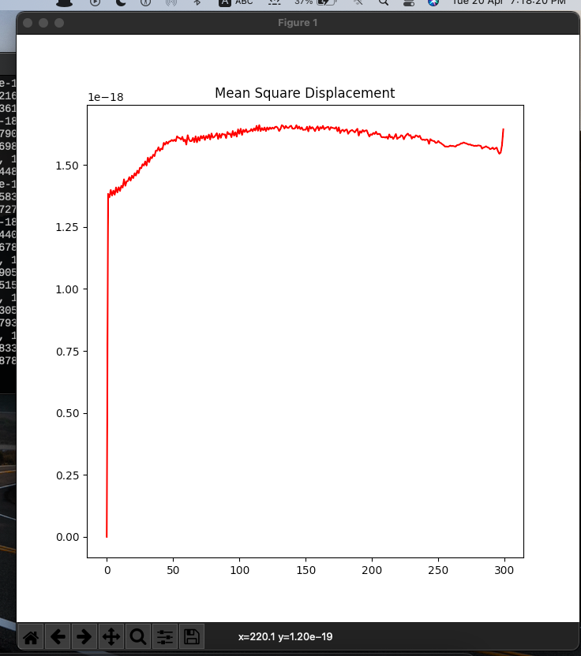
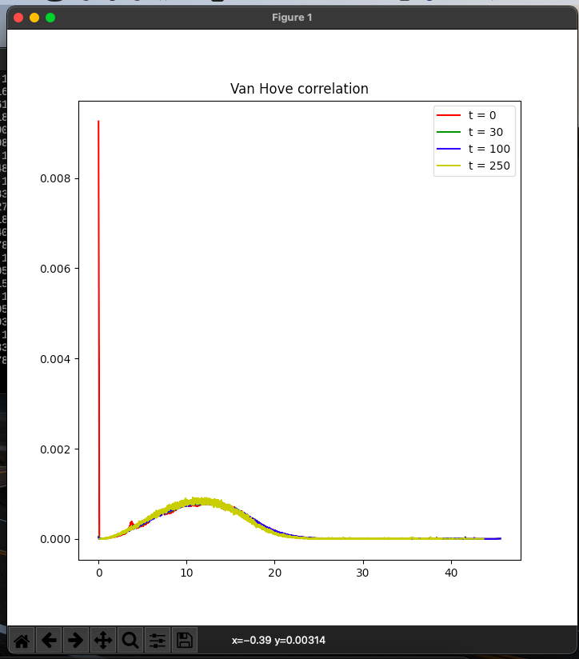
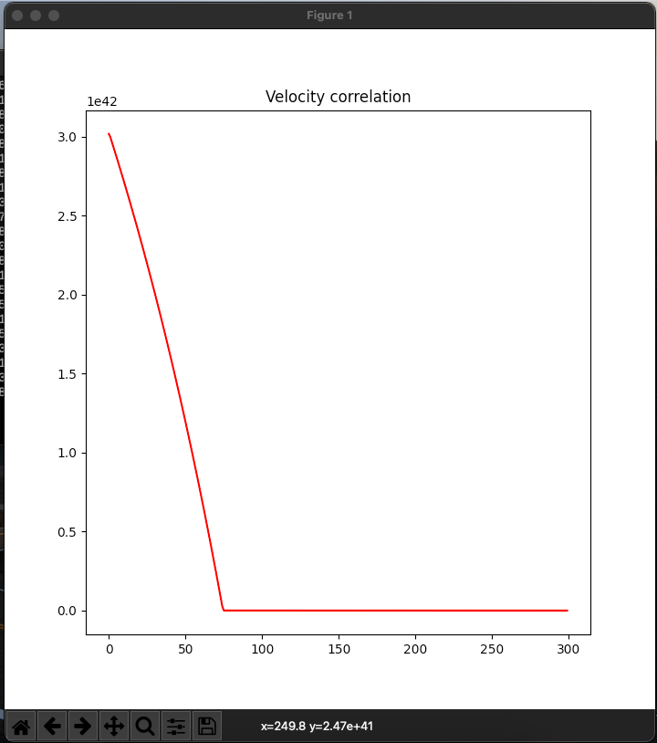

# PSCM - Final Project

### Hosted at 

[Link](https://rish-singhal.github.io/atoms-trajectory/)

### Description

Instructions to execute the program:

```bash
> python3 main.py
```

Following steps are implemented:

1. Intially 108 Argon atoms are generated randomly such that length of the box is 18 Angstrom
2. Potential Energy is minimized using gradient descent.
3. Initial velocities are sampled using Maxwell-Boltzman distribution with T = 300 Kelvin
4. Trajectory is generated for ITERATIONS = 300
5. Following plots are plotted:
	1. Mean Square Displacement Plot
	2. Van Hove Correlation 
	3. Velocity Correlation

### Constants

```python
N = 108 # Number of atoms
LEN = float(18*(10**-10)) # Angstrom
EPSILON = float(1.66*(10**-21)) # 0.238 kcal/mol
SIGMA = float(3.4*(10**-10)) # Angstrom
MIN_DIST = float(3.4*(10**-10)) # Angstrom

# For gradient descent
DELTA = 0.01 # energy difference to break gradient descent
ETA = 0.1 # learning rate

# For trajectory generation
ITERATIONS = 300
TIME_STEP = float(4*(10**-15)) # 4 femto seconds
MASS = float(6.633359936*(10**-26)) # mass of Argon (in Kg)

#For Sampeling velocities
K = float(1.38*(10**-10)) # Boltzman Constant
TEMP = 300 # Temperature = 300 Kelvin
```

### Plots

#### Mean Square Displacement



#### Van Hove Correlation



### Velcoity Correlation




### Deadline

**Phase-1**: 20th April 2021        
**Final**  : 25th April 2021

### TODO

- [ ] Plot the distribution of r_{ij}
- [ ] Add dynamic structure factor

### Author

[Rishabh Singhal](https://rish-singhal.github.io)
