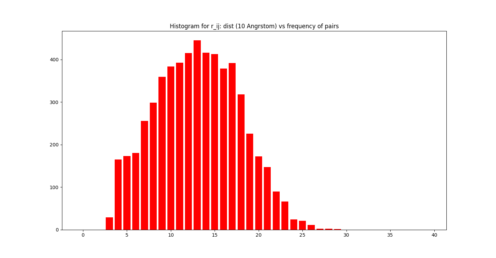
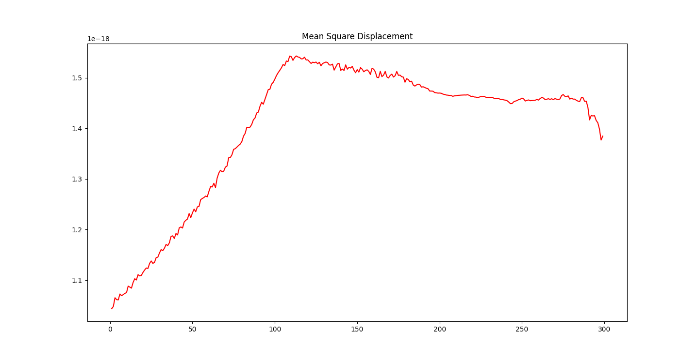
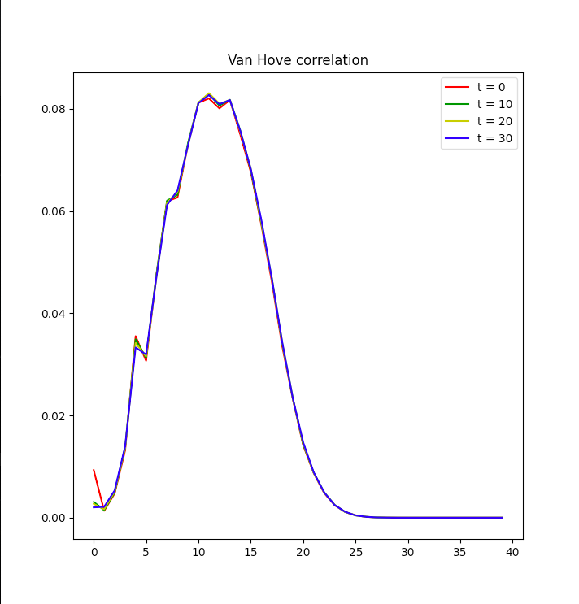
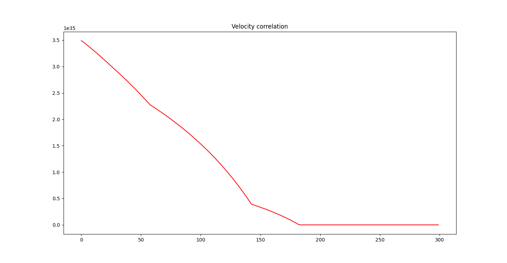
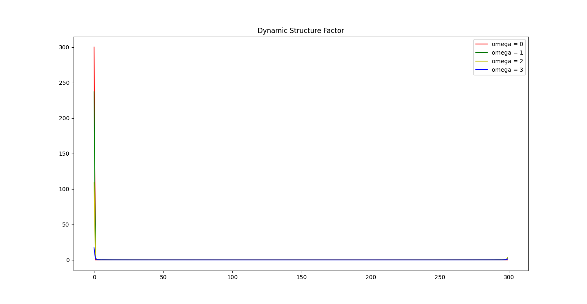

# PSCM - Final Project

[Web Version](https://rish-singhal.github.io/atoms-trajectory/)

### Technologies Used

**Language:** Python          

**Modules:** numpy, matplotlib, pickle, copy, tqdm

### Description

Following steps are implemented:

1. Intially 108 Argon atoms are generated randomly such that length of the box is 18 Angstrom
2. Potential Energy is minimized using gradient descent.
3. Initial velocities are sampled using Maxwell-Boltzman distribution with T = 300 Kelvin
4. Trajectory is generated for ITERATIONS = 300
5. Following plots are plotted:
	- Mean Square Displacement Plot
	- Van Hove Correlation 
	- Velocity Correlation
	- Dynamic Structure Factor
	- Distance Frequency Graph

### Features

1. Command Line Interface
2. The frames once generated for X number of iterations is saved as a file "frames_{ITERATIONS}.pkl"
3. Van hove correlation matrix can also be saved as a file "vanhove_{ITERATIONS}.pkl"
4. 


### Instructions 

Instructions to execute the program:

```bash
> python3 main.py
```

After this a command line interface will be available, showing this

```bash
>> help
```
Execute "help" function for the functions which can be called in the program.

### HELP

The following functions are available for command line interface.

```bash

ls ---->                |Print the pkl file names in the current directory
gen ITERATIONS ---->    |Generate ITERATIONS and save in file
load INPUT_FILE ---->   |Provide Input File
load vanhove INPUT_FILE |Provide Input File
plot msd ---->          |Plot Mean Square Displacement
plot vanhove ---->      |Plot Van Hove Correlation
plot vel --->           |Plot Velocity Correlation
plot df --->            |Plot Dynamic Factor
exit ---->              |EXIT
```


### Constants

```python
N = 108 # Number of atoms
LEN = 18e-10 # Angstrom
EPSILON = 1.66e-21 # 0.238 kcal/mol
SIGMA = 3.4e-10 # Angstrom
MIN_DIST = 3.4e-10 # Angstrom

# For gradient descent
DELTA = 0.01 # energy difference to break gradient descent
ETA = 0.1 # learning rate

# For trajectory generation
ITERATIONS = 300 # can be taken as an input too
TIME_STEP = 4e-15 # 4 femto seconds
MASS = 6.633359936e-26 # mass of Argon (in Kg)

#For Sampeling velocities
K = 1.38e-10 # Boltzman Constant
TEMP = 300 # Temperature = 300 Kelvin
```

### Sample Plots for 300 ITERATIONS

#### Pair Distance Bar Graph



#### Mean Square Displacement



#### Van Hove Correlation



#### Velocity Correlation



#### Dynamic Structure Factor




### Deadline

**Phase-1**: 20th April 2021        
**Final**  : 25th April 2021

### Author

**Name:** [Rishabh Singhal](https://rish-singhal.github.io)             
**Roll Number:** 20171213             
**Course Name:** Physics of Soft Condensed Matter, IIIT Hyderabad


